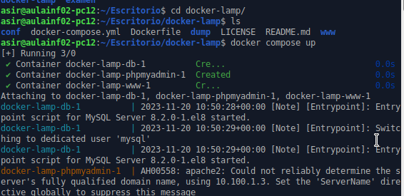
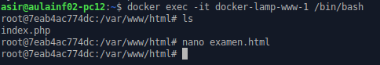
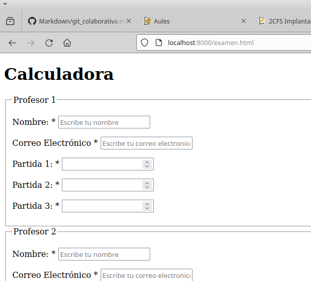

### **Capturas sobre el docker del examen y que esta en funcionamiento**
---

Primero arrancar el contender docker 

Despues entrar al contenedor  y crear los archivos del examen

y comprobar que en el navegador puedo acceder a ese archivo

